# Learning git/gitlab for team work

You probably have had an introduction to Git in a previous course. During the coding weeks, we will be using Git in a more advanced way, as we will learn how to use it as a team.

This tutorial will teach you the best practices to use when developing a team project. You have to follow it together.
> Any actions you have to do are written like this. Pay attention to them !

## Setting things up

First, go to [gitlab](https://gitlab-cw3.centralesupelec.fr/). You should see a button "New Project" just like this:
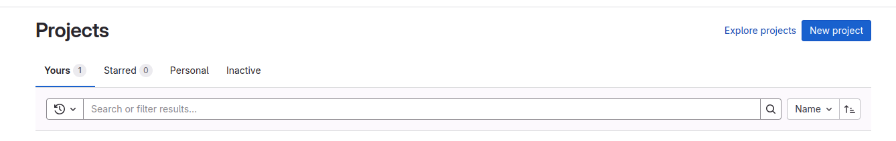

Click it to create a new project. You should get the following page; click "create blank project":
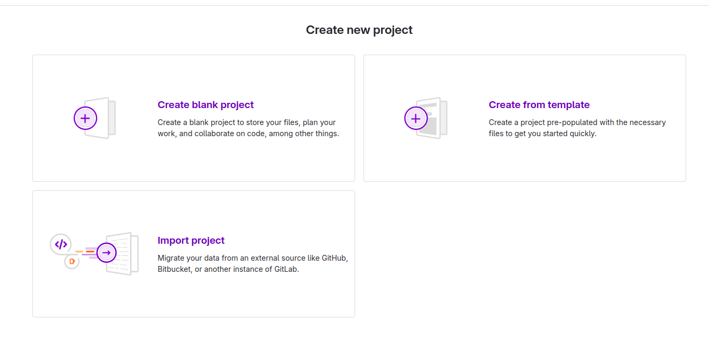

Next, you can configure settings for your project. You have to give it a name, and set its visibility level (use Private). Initialize the project with a README, this will make it easier for the next steps. Then, you can click "create project".
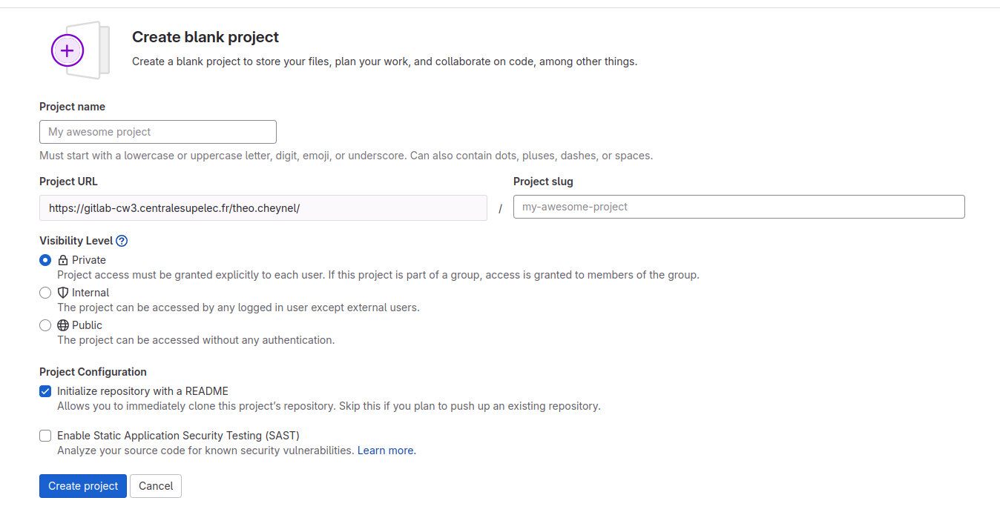

The interface now looks like this:
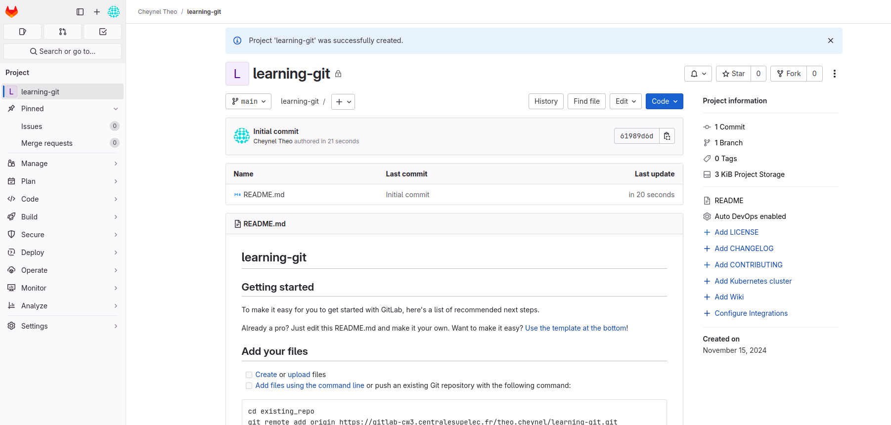
On the left part, you can see several tabs. Most of them are for an advanced use, but we will be using the "Project" tab as well as the "Manage" tab in the following tutorial.

The middle part contains a listing of the files present in your repository. So far, you only have the default README.md file. It is a text file written in Markdown, a markup language allowing basic text formatting. This file is used to store information about the project (for example : how to run the code, how to contribute to the project, etc.). The README.md is displayed underneath : so far, it contains basic information about git/gitlab.

## Adding an SSH key
Every member of the group is going to need to communicate with the Gitlab server. This requires the server to be able to identify each member of the group. The simplest way to do this is to use the SSH protocol (Secure Shell).

For this, we will need to generate a pair of SSH keys, for each group member.

> **EACH GROUP MEMBER** must now:
> 1. Open a terminal (Terminal on Mac / Linux, Git-bash on Windows) and run the command `ssh-keygen`.
> 2. This will prompt you to `Enter file in which to save the key (/path/to/default/location)`: simply press enter to save the file in its default location. This is important, otherwise Git will not know where to find your SSH key. If you already have a key, you can skip to step 5.
> 3. It will also prompt you to `Enter a passphrase`: if you set one, it will ask for it every time you use your SSH keys (useful if you work on a shared PC for example). In our case, it is simpler to leave this one blank. Enter the same passphrase when prompted for a confirmation.
> 4. You should get some output like this : `Your public key has been saved in /path/to/default/location/id_rsa.pub`. In fact, the ssh-keygen program has saved two text files next to each other : a public key and a private key. The private key should be kept secret, do not share it with anyone. Your public key is designed to be given to the web services, and will allow them to identify you by verifying that you own the private key.
> 5. Display the content of the public key file: `cat /path/to/default/location/id_rsa.pub` (replace with the actual path of your key). The `cat` program will print the content into the console.
> 6. Copy the public key, and go to [your gitlab settings](https://gitlab-cw3.centralesupelec.fr/-/user_settings/ssh_keys). Click on "Add New Key", and paste the whole key inside the "Key" text box. Finally, click on "Add Key".
> 7. To verify that you can communicate with the gitlab server, run the following inside of your terminal: `ssh -T git@gitlab-cw3.centralesupelec.fr`. This is just a basic check to see if the gitlab server is able to verify your key. You should get the following output: `Welcome to GitLab, @firstname.lastname!`

## Cloning the repository

Cloning is the act of creating a copy of the repository on your computer. It will allow you to modify the files and see the different versions.

> **EACH GROUP MEMBER** must now:
> 1. Open a terminal and move to the location where you want to clone the repository (using the `cd` command).
> 2. On the Gitlab page of your repository, click the blue "Code" button, and copy the "Clone with SSH" line (see below)
> 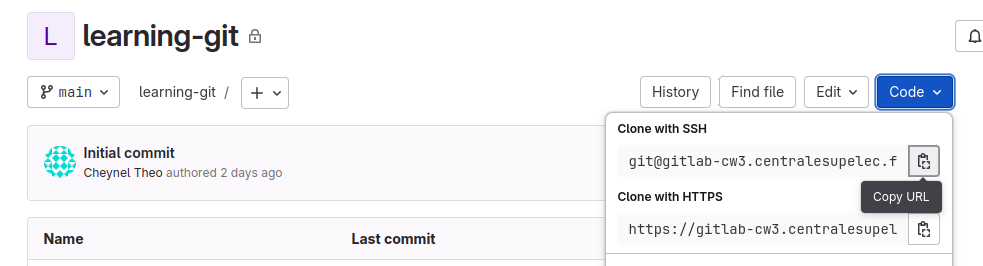
> 3. In the terminal, run `git clone git@gitlab-cw3.centralesupelec.fr:firstname.lastname/your-repo-name.git` (using the URL that you've just copied). You should see the following output:
> 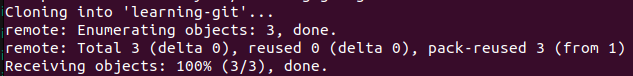
> 4. Now, run `cd your-repo-name` to move into the folder that git created. If you run `git status`, you should see the following output:
> 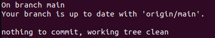

`git status` is a command that allows you to see which files have been changed since the last commit, and whether they are staged for the next commit (green) or not (red).

Now that you have cloned the repo, you can open your IDE (VSCode) in order to open the project folder.

> **EACH GROUP MEMBER** must now:
> 1. Open VSCode
> 2. Click on "Open Folder" and select the github repository.

## Your first commits
When we use git as a collaborative tool, we usually
> **GROUP MEMBER NUMBER 1** must now:
> 1. Edit the README.md file to delete all the default content, and leave a bullet list with as many bullets as your group has members, as shown below. We will ask each member to fill in their name.
> 
> 2. If you run the `git status` command in your terminal (either VSCode's integrated terminal, or your Terminal/GitBash app), you should see the following:
> 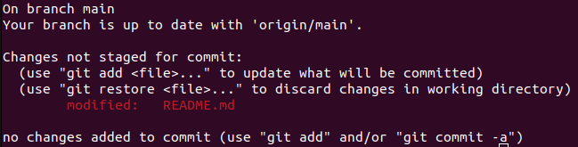
> 3. The README.md file appears in red (Changes not staged for commit). This means that git knows it has been modified, 
> 4. To add the changes to the staging area, you need to run `git add README.md`. Now, if you run `git status`, the file appears in green (Changes to be committed). 
> 5. To commit the changes, run `git commit -m "commit message"`. It is important to describe what you changed in the commit message, as this will allow others to understand what changes each commit contains.
> 6. So far, this new commit only exists on your local repository. To upload it to the Gitlab repository, run `git push`.

Let's verify that each group member can pull the changes, commit changes and push to the gitlab repo.
> **TURN BY TURN, EACH GROUP MEMBER (IN ALPHABETICAL ORDER) MUST NOW:**
> 1. Synchronize the changes using `git pull`
> 2. Add their name in the first  README.md file
> 3. Run `git add README.md`, `git commit -m "Add name to README.md`, and `git push`
> 4. Verify on Gitlab that the changes have indeed been pushed

You should do this step one after the other. If two people try to do it at once, the first one to push will not have any issues, but the second one will get the following error message:
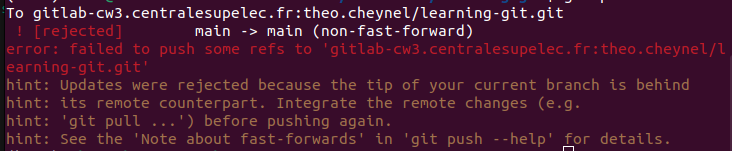

Here, the gitlab server is rejecting your push because the remote repository (on gitlab) contains recent changes (commits) that you do not have in your local repository. In that case, you should run `git pull`, which is a shortcut for two commands:
- `git fetch`, which updates the references (downloads all commits from the remote to your local repo, without applying them)
- `git merge origin/main`, which creates a new commit on your local branch with the changes that it just downloaded.
- If there are conflicts (meaning : your commits not yet pushed, and the commits you just downloaded, both edit the same parts of the same file), you will see: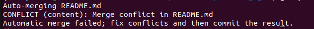
In that case, open README.md, fix the conflicts (which are delimited by conflict markers) and run `git add README.md`, then `git commit -m "Merge branch origin/main into main"` to perform the merge commit. 

Now that you have the most recent version, you can safely `git push` (unless someone else has pushed while you were fixing the conflicts).

If you get the following error message, that is because the behaviour of `git pull` is not specified, run `git config pull.rebase false`, and try again.
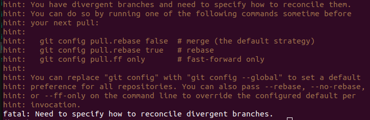

## Learning to work together
So far, we have only been working on the `main` branch. However, think about what would happen if:
- We always want to have a quick access to a working version of the project (for example, to show the teachers when they come to our table)?
- Two developers modify the same part of the same file, causing conflicts?
- One developer pushes a commit which causes an error or a bug?

To address those issues, we have to use the collaborative tools of Git and Gitlab. To illustrate, we are going to build a small hangman game in Python, where the user has to guess a word letter by letter.

First, we are going to create another branch, called "dev", and add some default files to it, which we will fill later on during the project.
> **GROUP MEMBER NUMBER 1** must now:
> 1. Make sure you have the latest version of the code by running `git pull`.
> 2. Create a new branch called "dev" by running `git branch dev`, and check out the dev branch using `git checkout dev`
> 3. Using VSCode, create a new file called "hangman.py" (do not forget the .py !), and paste the content of [this file](python/hangman.py) inside. It is a template containing empty functions for the hangman game, which each member will have to fill one. 
> 4. Similarly, create a new file called "test_hangman.py", and paste the content of [this file](python/test_hangman.py). It is a file containing tests for the functions that the members of the group will implement in hangman.py.
> 5. Finally, create a new file called "words.txt", and paste the content of [this file](python/words.txt). It is a text file containing a lot of words, which are going to be used to pick a random word for the hangman game.
> 6. Also create a file called ".gitignore", and paste the content of [this file](python/.gitignore). This tells git which kind of files NOT to track : files that are automatically generated by your IDE, etc.
> 7. Add and commit those two files : `git add hangman.py test_hangman.py words.txt .gitignore`, and `git commit -m "Add template files"`
> 8. Push your changes to the remote repository using `git push`. 
As the `dev` branch does not exist yet, you are going to get the following error from gitlab: `fatal: The current branch dev has no upstream branch`. 
Since this is your first time pushing a new branch to the remote repository, you have to run a specific command: `git push --set-upstream origin dev`.

Next, we are going to work in parallel on those files. To go faster, each group member is responsible for implementing one function. 
- Group member number 1 : follow [these instructions](instructions/hangman_member_1.md)
- Group member number 2 : follow [these instructions](instructions/hangman_member_2.md)
- Group member number 3 : follow [these instructions](instructions/hangman_member_3.md)
- Group member number 4 : follow [these instructions](instructions/hangman_member_4.md)
- Group member number 5 : follow [these instructions](instructions/hangman_member_5.md)
- Group member number 6 : follow [these instructions](instructions/hangman_member_6.md)
