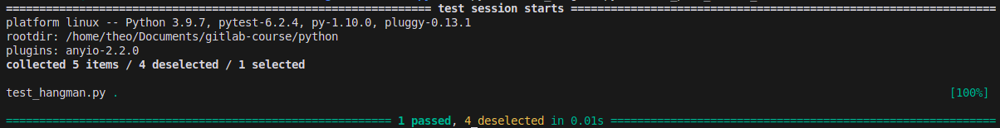
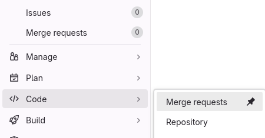
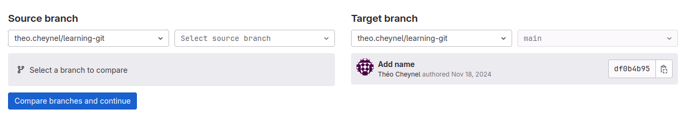
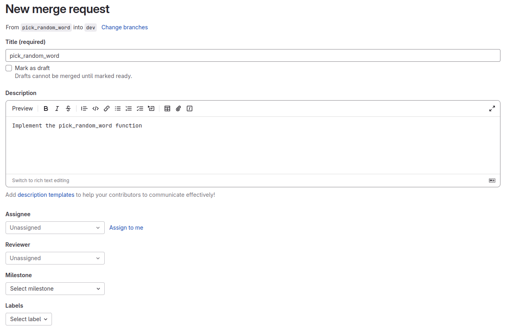

### Goal
Your task is to implement the `format_hidden_word` function. 

### Instructions
> You have to:
> 1. Run `git checkout dev` to check out the "dev" branch
> 2. Run `git pull` to get the latest version
> 3. Run `git branch format_hidden_word` and `git checkout format_hidden_word`, in order to create a new branch called "format_hidden_word".
> 4. Open the file `hangman.py`, and implement the `format_hidden_word` function. To do so, you have to return a new string which contains the word_to_guess, where only the letters present in letters_guessed are shown. Other letters are replaced with an underscore ("_")
> 5. Run the provided tests. To do so, we will use `pytest`, which is a Python test suite. 
First, install pytest using `python -m pip install pytest` (or `python3` for Mac users). 
Then, run `pytest test_hangman.py -k test_format_hidden_word`
This syntax tells pytest to find the test named `test_format_hidden_word`, and run it. You should get a test report similar to this:
> 
> 6. Once your function passes all the tests, you can add, commit and push your changes: `git add hangman.py`, `git commit -m "Implement format_hidden_word"`, `git push --set-upstream origin format_hidden_word` (since this is the first time pushing this new branch to the remote repository)

Now that we have pushed the branch for the format_hidden_word feature, we want to merge this branch into the `dev` branch. However, we won't allow just anyone to merge their code into `dev`: what is someome makes a mistake in their code, and starts merging code with errors? Instead, we are going to use one of Gitlab's powerful tools : "**merge requests**".

### Making a merge request
> You have to:
> 1. Open the Gitlab page of your project, and click on Code > Merge Requests

> 2. Click on "New Merge Request". You should get the following interface:

> 3. The "Source branch" is the branch containing the new code that we want to merge, in our case, we need to set it to the `format_hidden_word` branch.
The "Target branch" is the branch onto which we want to merge those commits, in our case, the `dev` branch.
Set those two branches and click on "Compare branches and continue". You should see this interface:

> Here, you can provide a description of your merge request, to help the reviewer understand what changes you have made. You can assign a reviewer (and other project management items: labels, milestones etc.)
> Do not assign a reviewer for now, simply add a title and description, and click on "Create Merge Request". We will ask one of your teammates to review it later, once every merge request is created.

