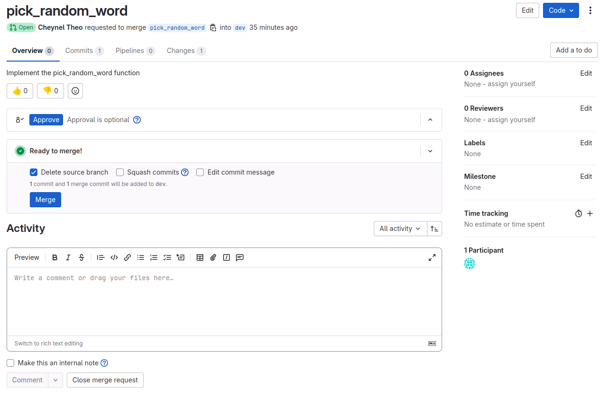
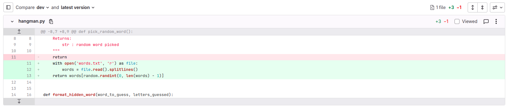
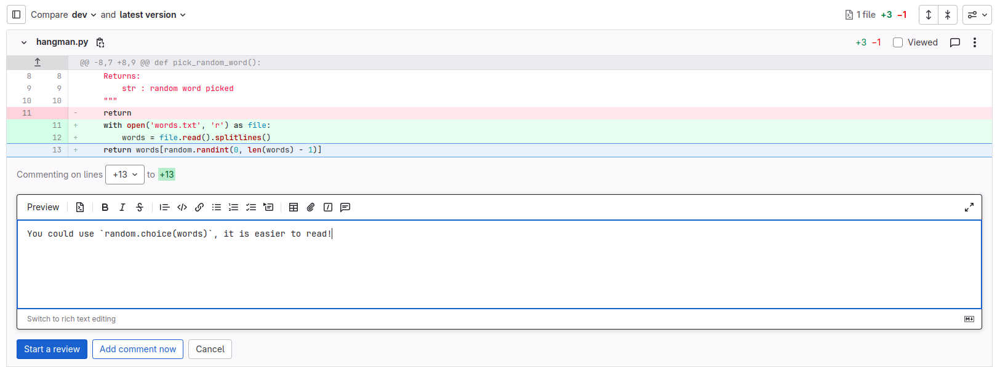
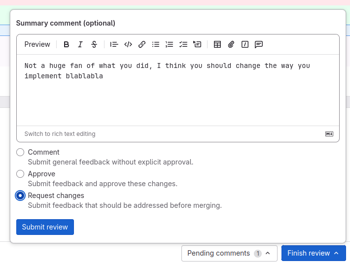
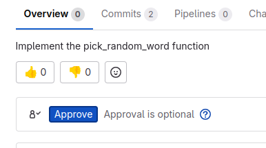

## What now ?

Each group member has created one merge request. Thhe goal of merge request is to propose code changes, allow other members to review it, suggest modifications or ask for clarification, and (if all goes well) merge the proposed changes into the target branch.

Let's review and merge the first merge request all together ! Pay attention, you will have to do one by yourself later.

> Open the "pick_random_word" merge request. It should look something like this:

> Here, you can see an overview of the merge request : the origin and destination branches, a title, a short description, and buttons to approve the request or merge the changes. On the right, you can assign reviewers, labels, etc (for project management purposes).
> If you open the "Changes" tab, you can see a "Git diff": a visualization of the changes that have been applied to the file in the commits of the pick_random_word branch.

> Deleted code is highlighted in red, and added code is highlighted in green. 
> If you want to comment a particular line, for instance to suggest a better way to do it, you can click on the line number and add a comment and start a review:
> 
> Once you've made comments on the code, you can "Finish review", and provide an overall comment, either requesting changes, approving or simply commenting the merge request.
> 
> If you have no comments to make, you can simply switch back to the first tab and "Approve":
>  
> Once this is done, either the reviewer (you) or the author (group member 1) can merge the pull request, by clicking the Merge button. It will also delete the branch on the remote repository if you want it to.

Great. Now, let's do this for all merge requests. 

> **EVERY GROUP MEMBER** must now pick a merge request to review.
> 1. Open the merge request in gitlab and read the changes. 
> 2. Make any comments you have on the code.
> 3. If you require changes, write a message on the merge request to explain what to change, and ask the author to do the changes.
> 4. If not, accept the merge request and merge it into the `dev` branch (make sure that the author set the correct destination branch !)

## Testing the `game` function
Now that all functions are merged into one file, you should be able to play the hangman game. 
> **EACH GROUP MEMBER** can test that the hangman works properly:
> 1. Checkout the dev branch and pull the latest changes (commits that have been created by merging the merge requests) : `git checkout dev` and `git pull`
> 2. Run `python hangman.py`
> 3. Enjoy !

## Recap
In this part, we have shown how we can use git as a team, to code simultaneously on the same project (even on the same file !).

What made this so easy, is that we split the tasks into several functions, defining their inputs and outputs.

Moreover, we used unit tests to validate each function, which helps minimize errors and diagnose issues before merging all functions together. In software development, an approach called "Test-Driven Development" is often used. It consists in writing the code for each function first, before even writing the function. This helps determine what the function is supposed to do, and you can iterate on the function until it passes all the tests, before refactoring the function without having to make sure that you're not breaking anything.

**However** in some cases, it is impossible to prevent a conflict. Conflicts happen when you have two modifications of the same parts of the same file. In the next part, we will create a situation in which a conflict occurs, and learn how to solve it.
