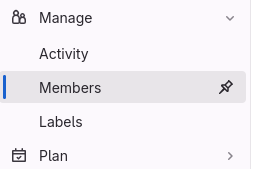

## Setting things up

To create the repository, only one group member has to work. The others should still read this, so that they know how to do it for their future projects.
> **GROUP MEMBER NUMBER 1** MUST NOW:
> 1. Go to [gitlab](https://gitlab-cw3.centralesupelec.fr/). You should see a button "New Project" just like this:

> 2. Click it to create a new project. You should get the following page; click "create blank project":

> 3. Next, you can configure settings for your project. You have to give it a name, and set its visibility level (use Private). Initialize the project with a README, this will make it easier for the next steps. Then, you can click "create project".

The gitlab interface looks like this:

On the left part, you can see several tabs. Most of them are for an advanced use, but we will be using the "Project" tab as well as the "Manage" tab in the following tutorial.

The middle part contains a listing of the files present in your repository. So far, you only have the default README.md file. It is a text file written in Markdown, a markup language allowing basic text formatting. This file is used to store information about the project (for example : how to run the code, how to contribute to the project, etc.). The README.md is displayed underneath : so far, it contains basic information about git/gitlab.

## Adding your teammates
So far, you are the only person able to see the repository, as it is private by default. There are also public repositories, that anyone on the internet can see. However, even when a repository is public, there is a limited list of people who are allowed to *contribute* to it (push commits).

> **GROUP MEMBER NUMBER 1** MUST NOW:
> 1. Open the "Manage > Members" tab
> 
> 2. Click on Invite Members, and add the other group members, with a role of Maintainer or Owner. The role defines the permissions of the member.
> If they already have an account on this Gitlab server, they will be added directly. If they haven't created an account yet, it should send them a registration email.
> 3. Check that everyone now has access to the repository.

