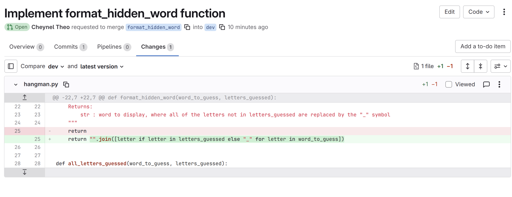
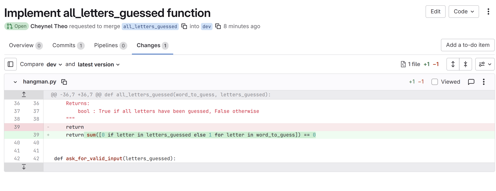
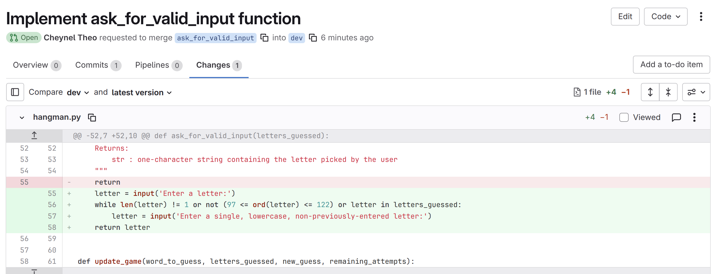
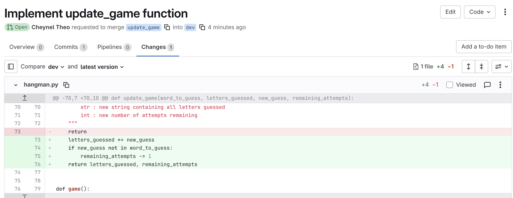
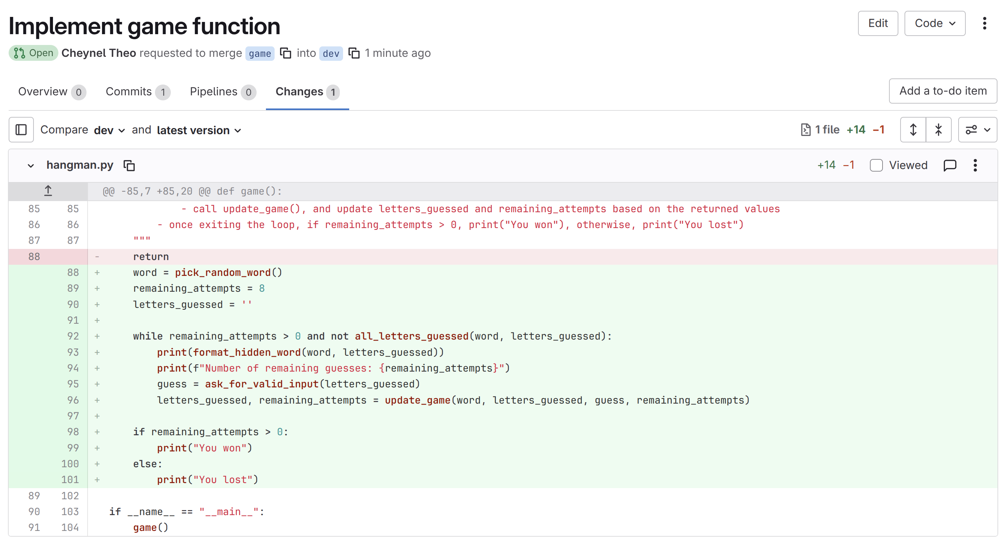
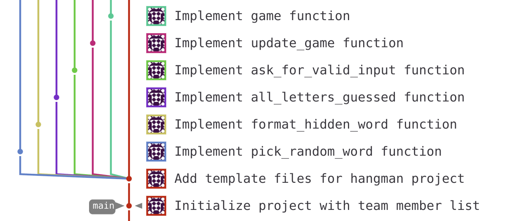
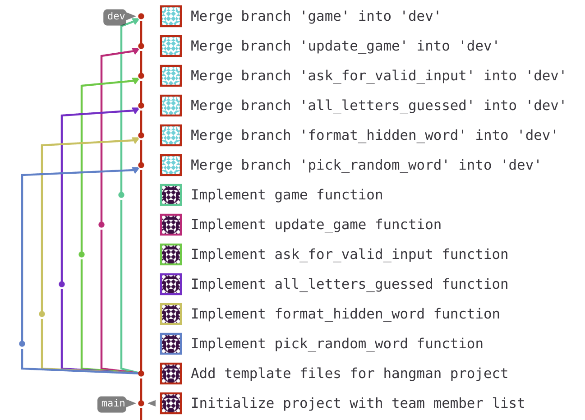

<!-- ROLE: A -->
A merge request (MR) is a formal way to propose changes to a project. It allows team members to review code, discuss improvements, and ensure quality before changes are integrated into the main codebase.

## What to do

### Step 1: Navigate to Merge Requests

1. In your GitLab project, click **Merge requests** in the left sidebar
2. Click the **New merge request** button

### Step 2: Select Source and Target Branches

**Choose your branches carefully:**

1. **Source branch**: Select the branch containing your changes (`pick_random_word`)
   
2. **Target branch**: Select where you want to merge to (`dev`)

3. Click **Compare branches and continue**

### Step 3: Fill Out Merge Request Details

1. **Title**: Write a clear, descriptive title, something like "Implement pick_random_word function for hangman game"

2. **Description**: Include important details that a reviewer should read before reading your code (summary of what was changed and why, etc). In our case, the changes are small, but in your next projects, Merge Requests might contain more complex code.

3. **Assignee**: You can assign yourself to the MR (meaning if someone requests changes, you're the one to implement those changes).

4. **Reviewer**: Select Team Member F to review your code

### Step 4: Review Before Creating

Before clicking "Create merge request":

1. **Check the file changes**:
   - Click on **Changes** tab to see your modifications (green lines = additions, red lines = deletions)
   - Check that the changes look correct, and that they are all relevant to this MR 

3. **Set merge options**:
   - **Delete source branch when merge request is accepted** (for branches implementing one feature, you won't need the branch again once it is merged into `dev`)
   - **Squash commits when merge request is accepted** (optional, keeps history clean if you did several commits on your branch)

### Step 5: Create the Merge Request

Click **Create merge request** to submit it for review.

## Reviewing your first MR

[!WAIT]
Wait until **Team Member B** has created their Merge Request.
[/!WAIT]

You can then review the MR of **Team Member B** (`format_hidden_word` -> `dev`):
1. **Overview**: You can read their description to get an idea of what the MR contains, in the "Overview" tab
2. **Changes**: You can review the proposed changes to their code in the "Changes" tab (see below)
3. **Discussion**: You can add comments and discussion, request changes, etc
4. **Approval**: You must give your approval by clicking the "Approve" button in the "Overview" tab
5. **Merge**: Once approved, the MR can be merged by clicking the "Merge" button

## Wait -- no conflicts?
You'll see that all six merge requests can be merged without any conflicts.

This is because by splitting the code into independent chunks, and having one MR for each chunk, no two people were editing the same part of the file!

Conflicts happen when several people edit the same part of the same file -- which, most of the time, can be prevented by properly planning the development phase.
<!-- /ROLE: A -->

<!-- ROLE: B -->
A merge request (MR) is a formal way to propose changes to a project. It allows team members to review code, discuss improvements, and ensure quality before changes are integrated into the main codebase.

## What to do

### Step 1: Navigate to Merge Requests

1. In your GitLab project, click **Merge requests** in the left sidebar
2. Click the **New merge request** button

### Step 2: Select Source and Target Branches

**Choose your branches carefully:**

1. **Source branch**: Select the branch containing your changes (`format_hidden_word`)
   
2. **Target branch**: Select where you want to merge to (`dev`)

3. Click **Compare branches and continue**

### Step 3: Fill Out Merge Request Details

1. **Title**: Write a clear, descriptive title, something like "Implement format_hidden_word function for hangman game"

2. **Description**: Include important details that a reviewer should read before reading your code (summary of what was changed and why, etc). In our case, the changes are small, but in your next projects, Merge Requests might contain more complex code.

3. **Assignee**: You can assign yourself to the MR (meaning if someone requests changes, you're the one to implement those changes).

4. **Reviewer**: Select Team Member A to review your code

### Step 4: Review Before Creating

Before clicking "Create merge request":

1. **Check the file changes**:
   - Click on **Changes** tab to see your modifications (green lines = additions, red lines = deletions)
   - Check that the changes look correct, and that they are all relevant to this MR 

3. **Set merge options**:
   - **Delete source branch when merge request is accepted** (for branches implementing one feature, you won't need the branch again once it is merged into `dev`)
   - **Squash commits when merge request is accepted** (optional, keeps history clean if you did several commits on your branch)

### Step 5: Create the Merge Request

Click **Create merge request** to submit it for review.

## Reviewing your first MR

[!WAIT]
Wait until **Team Member C** has created their Merge Request.
[/!WAIT]

You can then review the MR of **Team Member C** (`all_letters_guessed` -> `dev`):
1. **Overview**: You can read their description to get an idea of what the MR contains, in the "Overview" tab
2. **Changes**: You can review the proposed changes to their code in the "Changes" tab (see below)
3. **Discussion**: You can add comments and discussion, request changes, etc
4. **Approval**: You must give your approval by clicking the "Approve" button in the "Overview" tab
5. **Merge**: Once approved, the MR can be merged by clicking the "Merge" button

## Wait -- no conflicts?
You'll see that all six merge requests can be merged without any conflicts.

This is because by splitting the code into independent chunks, and having one MR for each chunk, no two people were editing the same part of the file!

Conflicts happen when several people edit the same part of the same file -- which, most of the time, can be prevented by properly planning the development phase.
<!-- /ROLE: B -->

<!-- ROLE: C -->
A merge request (MR) is a formal way to propose changes to a project. It allows team members to review code, discuss improvements, and ensure quality before changes are integrated into the main codebase.

## What to do

### Step 1: Navigate to Merge Requests

1. In your GitLab project, click **Merge requests** in the left sidebar
2. Click the **New merge request** button

### Step 2: Select Source and Target Branches

**Choose your branches carefully:**

1. **Source branch**: Select the branch containing your changes (`all_letters_guessed`)
   
2. **Target branch**: Select where you want to merge to (`dev`)

3. Click **Compare branches and continue**

### Step 3: Fill Out Merge Request Details

1. **Title**: Write a clear, descriptive title, something like "Implement all_letters_guessed function for hangman game"

2. **Description**: Include important details that a reviewer should read before reading your code (summary of what was changed and why, etc). In our case, the changes are small, but in your next projects, Merge Requests might contain more complex code.

3. **Assignee**: You can assign yourself to the MR (meaning if someone requests changes, you're the one to implement those changes).

4. **Reviewer**: Select Team Member B to review your code

### Step 4: Review Before Creating

Before clicking "Create merge request":

1. **Check the file changes**:
   - Click on **Changes** tab to see your modifications (green lines = additions, red lines = deletions)
   - Check that the changes look correct, and that they are all relevant to this MR 

3. **Set merge options**:
   - **Delete source branch when merge request is accepted** (for branches implementing one feature, you won't need the branch again once it is merged into `dev`)
   - **Squash commits when merge request is accepted** (optional, keeps history clean if you did several commits on your branch)

### Step 5: Create the Merge Request

Click **Create merge request** to submit it for review.

## Reviewing your first MR

[!WAIT]
Wait until **Team Member D** has created their Merge Request.
[/!WAIT]

You can then review the MR of **Team Member D** (`ask_for_valid_input` -> `dev`):
1. **Overview**: You can read their description to get an idea of what the MR contains, in the "Overview" tab
2. **Changes**: You can review the proposed changes to their code in the "Changes" tab (see below)
3. **Discussion**: You can add comments and discussion, request changes, etc
4. **Approval**: You must give your approval by clicking the "Approve" button in the "Overview" tab
5. **Merge**: Once approved, the MR can be merged by clicking the "Merge" button

## Wait -- no conflicts?
You'll see that all six merge requests can be merged without any conflicts.

This is because by splitting the code into independent chunks, and having one MR for each chunk, no two people were editing the same part of the file!

Conflicts happen when several people edit the same part of the same file -- which, most of the time, can be prevented by properly planning the development phase.
<!-- /ROLE: C -->

<!-- ROLE: D -->
A merge request (MR) is a formal way to propose changes to a project. It allows team members to review code, discuss improvements, and ensure quality before changes are integrated into the main codebase.

## What to do

### Step 1: Navigate to Merge Requests

1. In your GitLab project, click **Merge requests** in the left sidebar
2. Click the **New merge request** button

### Step 2: Select Source and Target Branches

**Choose your branches carefully:**

1. **Source branch**: Select the branch containing your changes (`ask_for_valid_input`)
   
2. **Target branch**: Select where you want to merge to (`dev`)

3. Click **Compare branches and continue**

### Step 3: Fill Out Merge Request Details

1. **Title**: Write a clear, descriptive title, something like "Implement ask_for_valid_input function for hangman game"

2. **Description**: Include important details that a reviewer should read before reading your code (summary of what was changed and why, etc). In our case, the changes are small, but in your next projects, Merge Requests might contain more complex code.

3. **Assignee**: You can assign yourself to the MR (meaning if someone requests changes, you're the one to implement those changes).

4. **Reviewer**: Select Team Member C to review your code

### Step 4: Review Before Creating

Before clicking "Create merge request":

1. **Check the file changes**:
   - Click on **Changes** tab to see your modifications (green lines = additions, red lines = deletions)
   - Check that the changes look correct, and that they are all relevant to this MR 

3. **Set merge options**:
   - **Delete source branch when merge request is accepted** (for branches implementing one feature, you won't need the branch again once it is merged into `dev`)
   - **Squash commits when merge request is accepted** (optional, keeps history clean if you did several commits on your branch)

### Step 5: Create the Merge Request

Click **Create merge request** to submit it for review.

## Reviewing your first MR

[!WAIT]
Wait until **Team Member E** has created their Merge Request.
[/!WAIT]

You can then review the MR of **Team Member E** (`update_game` -> `dev`):
1. **Overview**: You can read their description to get an idea of what the MR contains, in the "Overview" tab
2. **Changes**: You can review the proposed changes to their code in the "Changes" tab (see below)
3. **Discussion**: You can add comments and discussion, request changes, etc
4. **Approval**: You must give your approval by clicking the "Approve" button in the "Overview" tab
5. **Merge**: Once approved, the MR can be merged by clicking the "Merge" button

## Wait -- no conflicts?
You'll see that all six merge requests can be merged without any conflicts.

This is because by splitting the code into independent chunks, and having one MR for each chunk, no two people were editing the same part of the file!

Conflicts happen when several people edit the same part of the same file -- which, most of the time, can be prevented by properly planning the development phase.
<!-- /ROLE: D -->

<!-- ROLE: E -->
A merge request (MR) is a formal way to propose changes to a project. It allows team members to review code, discuss improvements, and ensure quality before changes are integrated into the main codebase.

## What to do

### Step 1: Navigate to Merge Requests

1. In your GitLab project, click **Merge requests** in the left sidebar
2. Click the **New merge request** button

### Step 2: Select Source and Target Branches

**Choose your branches carefully:**

1. **Source branch**: Select the branch containing your changes (`update_game`)
   
2. **Target branch**: Select where you want to merge to (`dev`)

3. Click **Compare branches and continue**

### Step 3: Fill Out Merge Request Details

1. **Title**: Write a clear, descriptive title, something like "Implement update_game function for hangman game"

2. **Description**: Include important details that a reviewer should read before reading your code (summary of what was changed and why, etc). In our case, the changes are small, but in your next projects, Merge Requests might contain more complex code.

3. **Assignee**: You can assign yourself to the MR (meaning if someone requests changes, you're the one to implement those changes).

4. **Reviewer**: Select Team Member D to review your code

### Step 4: Review Before Creating

Before clicking "Create merge request":

1. **Check the file changes**:
   - Click on **Changes** tab to see your modifications (green lines = additions, red lines = deletions)
   - Check that the changes look correct, and that they are all relevant to this MR 

3. **Set merge options**:
   - **Delete source branch when merge request is accepted** (for branches implementing one feature, you won't need the branch again once it is merged into `dev`)
   - **Squash commits when merge request is accepted** (optional, keeps history clean if you did several commits on your branch)

### Step 5: Create the Merge Request

Click **Create merge request** to submit it for review.

## Reviewing your first MR

[!WAIT]
Wait until **Team Member F** has created their Merge Request.
[/!WAIT]

You can then review the MR of **Team Member F** (`game` -> `dev`):
1. **Overview**: You can read their description to get an idea of what the MR contains, in the "Overview" tab
2. **Changes**: You can review the proposed changes to their code in the "Changes" tab (see below)
3. **Discussion**: You can add comments and discussion, request changes, etc
4. **Approval**: You must give your approval by clicking the "Approve" button in the "Overview" tab
5. **Merge**: Once approved, the MR can be merged by clicking the "Merge" button

## Wait -- no conflicts?
You'll see that all six merge requests can be merged without any conflicts.

This is because by splitting the code into independent chunks, and having one MR for each chunk, no two people were editing the same part of the file!

Conflicts happen when several people edit the same part of the same file -- which, most of the time, can be prevented by properly planning the development phase.
<!-- /ROLE: E -->

<!-- ROLE: F -->
A merge request (MR) is a formal way to propose changes to a project. It allows team members to review code, discuss improvements, and ensure quality before changes are integrated into the main codebase.

## What to do

### Step 1: Navigate to Merge Requests

1. In your GitLab project, click **Merge requests** in the left sidebar
2. Click the **New merge request** button

### Step 2: Select Source and Target Branches

**Choose your branches carefully:**

1. **Source branch**: Select the branch containing your changes (`game`)
   
2. **Target branch**: Select where you want to merge to (`dev`)

3. Click **Compare branches and continue**

### Step 3: Fill Out Merge Request Details

1. **Title**: Write a clear, descriptive title, something like "Implement game function for hangman game"

2. **Description**: Include important details that a reviewer should read before reading your code (summary of what was changed and why, etc). In our case, the changes are small, but in your next projects, Merge Requests might contain more complex code.

3. **Assignee**: You can assign yourself to the MR (meaning if someone requests changes, you're the one to implement those changes).

4. **Reviewer**: Select Team Member E to review your code

### Step 4: Review Before Creating

Before clicking "Create merge request":

1. **Check the file changes**:
   - Click on **Changes** tab to see your modifications (green lines = additions, red lines = deletions)
   - Check that the changes look correct, and that they are all relevant to this MR 

3. **Set merge options**:
   - **Delete source branch when merge request is accepted** (for branches implementing one feature, you won't need the branch again once it is merged into `dev`)
   - **Squash commits when merge request is accepted** (optional, keeps history clean if you did several commits on your branch)

### Step 5: Create the Merge Request

Click **Create merge request** to submit it for review.

## Reviewing your first MR

[!WAIT]
Wait until **Team Member A** has created their Merge Request.
[/!WAIT]

You can then review the MR of **Team Member A** (`pick_random_word` -> `dev`):
1. **Overview**: You can read their description to get an idea of what the MR contains, in the "Overview" tab
2. **Changes**: You can review the proposed changes to their code in the "Changes" tab (see below)
3. **Discussion**: You can add comments and discussion, request changes, etc
4. **Approval**: You must give your approval by clicking the "Approve" button in the "Overview" tab
5. **Merge**: Once approved, the MR can be merged by clicking the "Merge" button

## Wait -- no conflicts?
You'll see that all six merge requests can be merged without any conflicts.

This is because by splitting the code into independent chunks, and having one MR for each chunk, no two people were editing the same part of the file!

Conflicts **only** happen when several people edit the same part of the same file -- which, most of the time, can be prevented by properly planning the development phase.

Below is an illustration of the git tree before and after merging all branches (which you can see in **Code** > **Repository Graph**):

Every time we merged a branch into `dev`, it created a new **merge commit** on dev with the changes from our branch. We can see that the `main` branch is outdated, as its last commit is the one where **Team Member F** wrote their name in the README.md

<!-- /ROLE: F -->